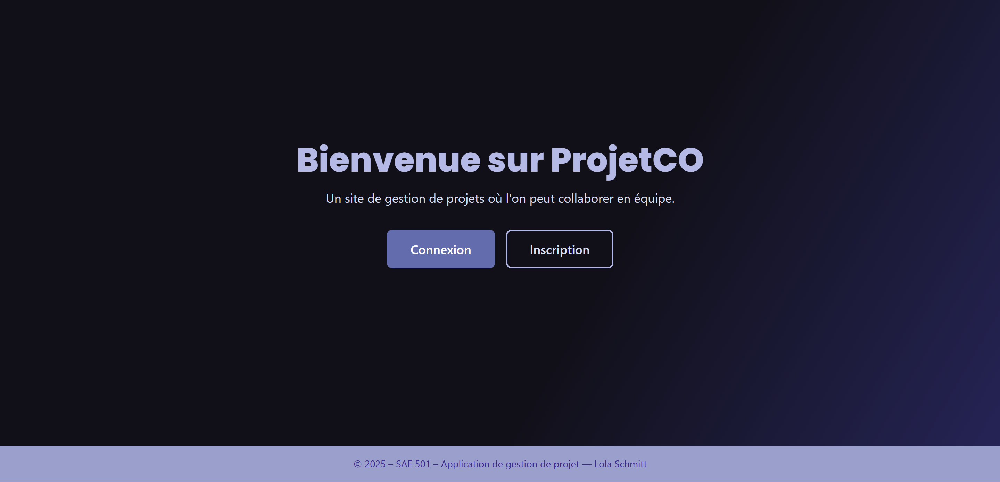
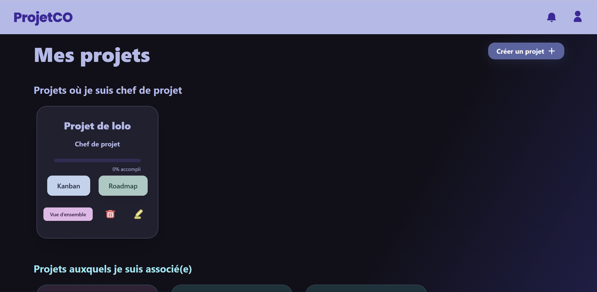
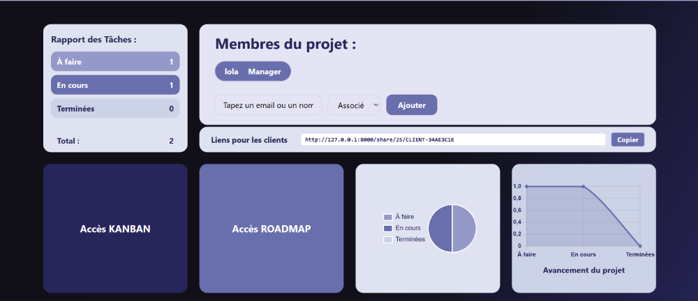
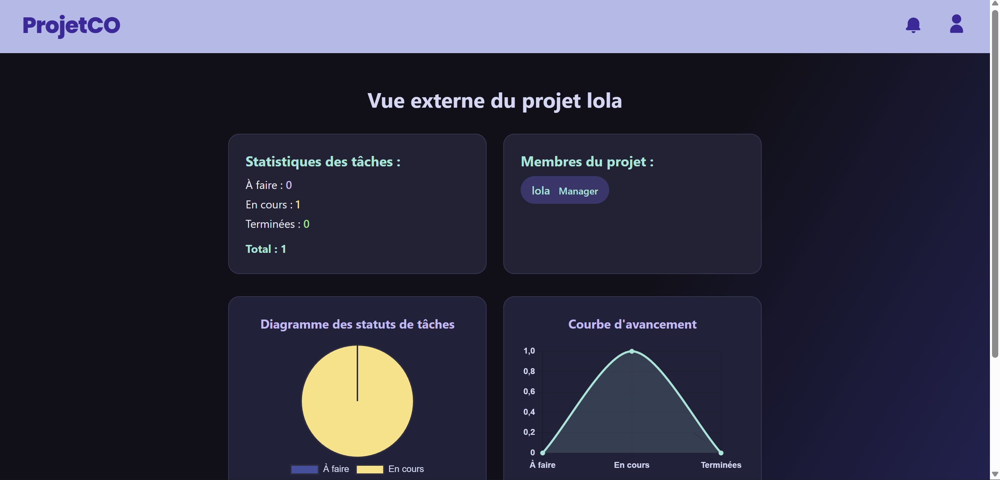
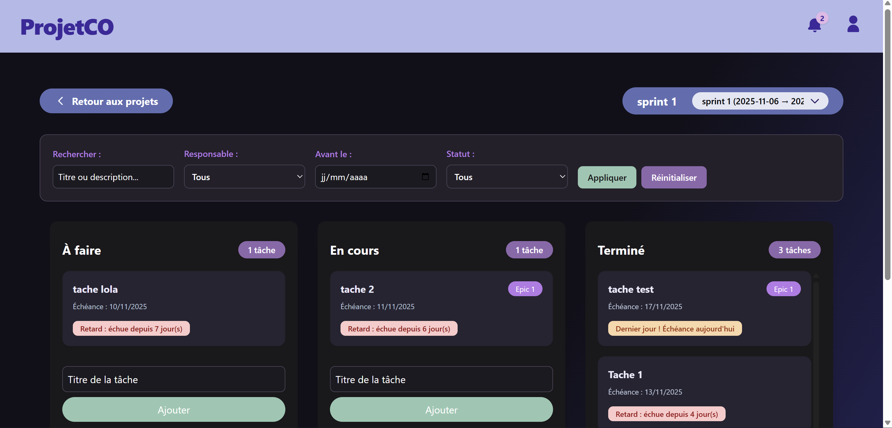
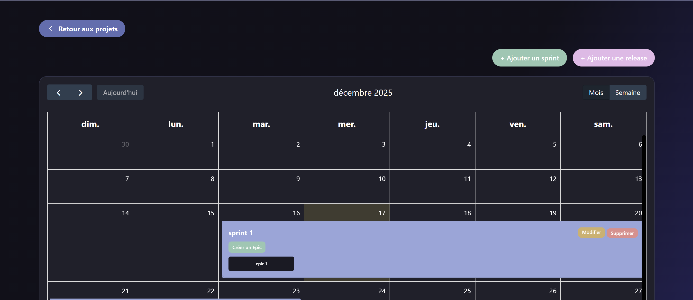

# ProjetCO - Application de gestion

## Description
Ce projet a été réalisé en novembre dernier, durant ma troisième année de BUT MMI, en travail individuel. J’ai pris en charge toutes les étapes, de l’analyse du besoin jusqu’au développement final, et j’ai travaillé sur ce projet également les week-ends par passion.

L’objectif était de développer une application web inspirée de Trello, permettant de gérer des projets collaboratifs en utilisant la méthode Agile et le Kanban. 

L’application inclut :
- Roadmap
- Tableau Kanban
- Gestion des rôles utilisateurs ( le manager peut gérer entièrement son projet, modifier les rôles des utilisateurs, et avoir une vue d’ensemble sur le projet, tandis que les associés peuvent uniquement modifier et déplacer leurs propres tâches dans le Kanban. Les managers peuvent créer un projet et être associés dans un autre projet avec le même compte )

Fonctionnalités avancées : 
- Système de notifications personnelles avertissant trois jours avant la fin d’une tâche ou en cas de retard
- Filtres dans le Kanban pour mieux visualiser les tâches et possibilité de déplacer les tâches par drag and drop
- Pour le roadmap : les sprints, les epics et les user stories sont intégrés, avec même la possibilité d’ajouter une release sur un jour précis.

ps : Un utilisateur peut être manager sur un projet et associé sur un autre avec le même compte.

---

## Fonctionnalités principales

- Création et gestion de projets
- Tableau Kanban avec drag and drop
- Filtres pour organiser les tâches
- Système de notifications :
  - Alerte 3 jours avant la fin d’une tâche
  - Notification en cas de retard
- Roadmap avec sprints, epics, user stories et releases
- Gestion des rôles utilisateurs
- Authentification complète (inscription et connexion)
  
---

## Mon rôle
J’ai réalisé l’intégralité du projet en autonomie :

- Analyse des besoins
- Rédaction du cahier des charges
- Définition des personas
- Création des user flows
- Conception des wireframes et maquettes
- Organisation du backlog (epics et user stories)
- Suivi du projet avec une méthodologie Agile

### Développement
- Conception de la base de données
- Développement front-end et back-end
- Implémentation des fonctionnalités dynamiques (drag and drop, filtres, notifications)
- Mise en place du système d’authentification

### UX / UI
- Conception de l’identité visuelle
- Interface ergonomique et intuitive

### Qualité
- Prise en compte de l’accessibilité
- Bonnes pratiques de sécurité
- Rédaction d’une documentation technique en anglais

---

## Technologies utilisées

---

## Aperçu du projet

### Page d’accueil

---

### Dashboard

---

### Vue d’ensemble

Le lien d’accès côté client est actuellement configuré en local (localhost).  
Il devra être modifié lors du déploiement.

---

### Vue client externe

---

### Tableau Kanban

---

### Roadmap

---

## Résultat
Le projet a été évalué dans le cadre de ma formation et validé lors d’une soutenance.

Il s’agit d’une application complète, fonctionnelle et ergonomique, développée en autonomie tout en respectant les principes de la méthodologie Agile.

---

## Retour d’expérience
Ce projet m’a permis de :
- Gérer un projet web complet en autonomie
- Appliquer concrètement la méthodologie Agile
- Concevoir une application avec gestion avancée des rôles utilisateurs
- Développer des fonctionnalités interactives

Il m’a également appris à m’organiser efficacement sur un projet long et à maintenir un bon niveau de rigueur en travaillant seul.

---

## Améliorations possibles
- Amélioration du système de notifications
- Optimisation du Kanban
- Ajout de fonctionnalités collaboratives
